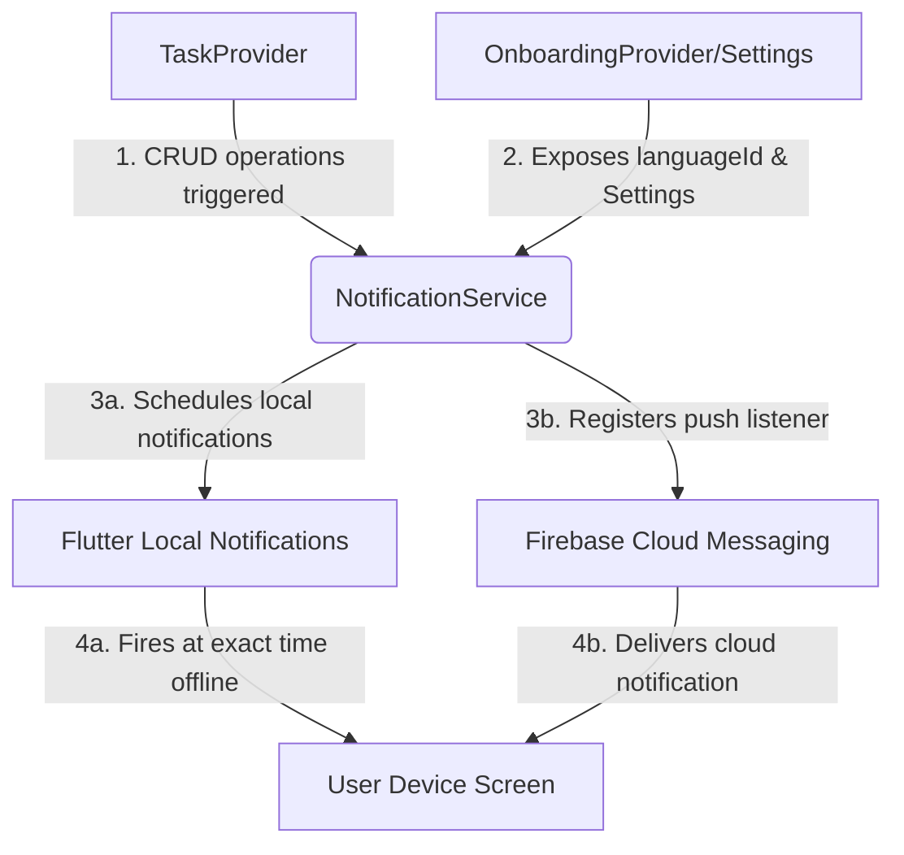

# Module 3 – Reminders & Notifications Implementation Plan for **Yaad Rakh**

> **Version:** 3.0 (Revised & Refactored)
> **Depends on:** Module 2 (Task Management - Core)
> **Stack:** Flutter + Hive + Flutter Local Notifications + Firebase Cloud Messaging (FCM)
> **State Management:** Provider

---

## 1. Overview

- **One-line purpose:** To alert users of their tasks in their preferred language at the exact right moment, keeping them organized and on track.
- **Why this module is critical:** If reminders fail or are delayed, the user will miss their tasks, destroying their trust in the app. For our target non-tech-savvy Pakistani audience (like housewives or shopkeepers), missing a doctor visit or a customer order because of a silent notification means they will uninstall the app immediately. Reliability, offline execution, and correct language selection are non-negotiable.
- **Key constraints & non-negotiables:**
  1. **100% Offline-First:** Reminders must fire at the correct local time even if the user has no internet access for weeks.
  2. **Zero Missing Alarms:** Must survive app force-closes, device reboots, and aggressive Android OEM background battery optimization (e.g., Doze mode).
  3. **Strict Localization:** The notification title and body must be fully rendered in the user's selected language (Urdu script, Roman Urdu, or English) at the time of scheduling/rescheduling.
  4. **FCM Synchronization Scope:** FCM is included for foreground notifications and system-wide announcements. *Note: Storing, pushing tokens to a remote database, and server-side cloud triggers are explicitly out of scope for this offline-first local module, and are deferred to Phase 2.*

---

## 2. Architecture & Tech Stack

### Packages & Libraries

| Package | Recommended Version | Purpose |
|---------|---------------------|---------|
| `flutter_local_notifications` | `^17.2.1` | Native local alerts, scheduling exact alarms, recurring notifications. |
| `firebase_messaging` | `^15.0.0` | Remote push notifications for cloud updates and announcements. |
| `timezone` | `^0.9.4` | Precise timezone parsing, handling daylight savings and localized timing offsets. |
| `flutter_timezone` | `^1.0.8` | Detects the device's native timezone region (e.g., `Asia/Karachi`) to initialize `timezone`. |
| `meta` | `^1.11.0` | Employs architectural annotations like `@visibleForTesting` to test helpers without breaking encapsulation. |

### Architecture Pattern

This module utilizes a **Service-Provider Pattern**:
- **`NotificationService` (Singleton/Service):** A pure utility wrapper around the low-level platform APIs (Local Notifications & FCM). It contains all initialization, permission requests, and scheduling logic. It has zero business logic and does not depend on UI.
- **`NotificationProvider` (ChangeNotifier):** Manages user preferences (e.g., default reminder offset, notification toggles, custom morning summary time) and persists them in the settings Hive box.
- **Integration with other modules:**
  - **`TaskProvider`:** Whenever a task is added, updated, or marked as completed/deleted, `TaskProvider` will call `NotificationService` to register or cancel the corresponding local scheduled notification.
  - **`OnboardingProvider` (Settings):** Exposes the current active `languageId` ('en', 'ur', 'roman_ur') so that notifications can be scheduled in the correct language.



---

## 3. Feature Breakdown

### 3.1 Reminder Timing Options
- **Implementation Approach:**
  - When scheduling a reminder, extract the target time using a pure static helper `calculateScheduledTime()`. This isolates the decision logic from native scheduling plugins, making it easily testable in unit tests.
  - If a valid scheduled time is returned, convert it to a timezone-aware `TZDateTime` object.
- **Decision Logic Tree (`calculateScheduledTime`):**
  - **Branch 1 (Future Offset):** If the subtracted offset time is in the future, schedule the reminder for that offset.
  - **Branch 2 (On-Time Fallback):** If the offset time is in the past, but the due date/time itself is still in the future, fallback to scheduling exactly "On Time".
  - **Branch 3 (Expired):** If both the offset time and the due date/time are in the past, skip scheduling entirely.
- **Potential failure points:**
  - Standard timezone changes or daylight saving transitions (handled by using the `timezone` library rather than pure `DateTime` arithmetic).

### 3.2 Localized Notifications
- **Implementation Approach:**
  - Fetch the user's active `languageId` dynamically from the `settings` Hive box at **scheduling/rescheduling time** (instead of relying on stale, task-level variables).
  - Provide a localization lookup engine within the notification service. Compile the title/body text based on the active language.
  - **Language Change Rescheduling Routine:** When the user changes their language settings, the Settings screen triggers a clean reschedule. All pending notifications are cancelled and immediately rescheduled using the new language template.
- **Edge cases to handle:**
  - **Language changed in settings:** If the user switches the app language from Roman Urdu to Urdu, already-scheduled notifications must be updated immediately.
- **Potential failure points:**
  - Operating system fonts failing to render Arabic script (Urdu) in notifications. Standard Android/iOS systems have native system-level fallbacks, but some customized OEM ROMs might display block squares if not styled correctly.

### 3.3 Offline Reminders & Boot Rescheduling
- **Implementation Approach:**
  - Rely exclusively on Android's `AlarmManager` and iOS's `UNUserNotificationCenter` via `flutter_local_notifications`. These utilize hardware-backed OS schedulers that work entirely offline.
  - **Reboot Rescheduling Architecture:** Native Android clears the alarm tables upon reboot. While `flutter_local_notifications` has a built-in boot receiver that restores native alarms, SharedPreferences can get out-of-sync with Hive. 
  - To solve this completely, we introduce a **Sync-on-Startup Hook** in `main.dart` which queries all active local Hive tasks on app startup and triggers a fresh scheduling pass.
- **Edge cases to handle:**
  - **Device rebooted:** On Android, scheduled alarms are cleared from the system alarm table upon shutdown.
  - **Mitigation:** Enable the `RECEIVE_BOOT_COMPLETED` permission in `AndroidManifest.xml`. Create a background broadcast receiver that auto-launches the plugin to restore and reschedule all pending Hive tasks.
- **Potential failure points:**
  - Battery optimization policies (Samsung, Xiaomi, Huawei, etc.) putting the app in a "deep sleep" state, preventing scheduled alarms from triggering. Show a subtle UI prompt guiding users to disable battery optimizations for **Yaad Rakh**.

### 3.4 Recurring Task Notifications
- **Implementation Approach:**
  - **Single Active-Instance Strategy:** To prevent alarm conflicts, memory pollution, and stale alerts, schedule the alarm *only* for the next upcoming occurrence. 
  - There is only ever *one* active instance of a recurring task in the local Hive box at any time. When the user marks the active instance as completed, `TaskProvider` writes it to local storage as completed, then automatically generates the *next* single future instance of that task (due date advanced by the recurrence interval) and saves it to Hive.
  - This database addition automatically triggers the standard `addTask` pipeline, scheduling the new occurrence's reminder dynamically.
- **Edge cases to handle:**
  - If a daily task is missed for three days, several expired reminders could accumulate.
  - **Mitigation:** When marking an overdue recurring task as complete, clean up all historical notifications for that task ID and start fresh.
- **Potential failure points:**
  - User never opens the app to mark the task completed. The chain of future recurring reminders will stop. Since this is an offline solo app, this is a reasonable default behavior to avoid spamming the device.

### 3.5 Morning Summary Notification ("Aaj ka Schedule")
- **Implementation Approach:**
  - **Pre-scheduled Rolling Summary Strategy:** Do not rely on flaky daily background services. Every time a task is added/modified/deleted, or the app is launched, calculate and schedule a dynamic morning summary notification for the next **7 consecutive days** at the user's configured morning summary time (defaulting to 8:00 AM).
  - **Zero-Task Filter:** To prevent spamming and improve the user experience, skip scheduling a morning summary for days that have `0` pending tasks. If a day slot previously had a summary scheduled but now has 0 tasks (due to a deletion or schedule change), explicitly cancel the notification for that specific slot.
  - For day `i` (0 to 6), fetch all tasks from Hive due on that date. Formulate the localized text: *"Salaam! Aaj aap ke 3 kaam hain."*
  - Schedule these 7 alarms using specific reserved IDs: `2000000` to `2000006`.
- **Edge cases to handle:**
  - Complete shifts in the task list. If a task due today is moved to tomorrow, the pre-scheduled morning summary must instantly re-calculate and overwrite the scheduled alarms.
- **Potential failure points:**
  - User doesn't open the app for over 7 days. The morning summaries will cease after day 7, which is a graceful, battery-friendly fallback.

### 3.6 Overdue Task Alert
- **Implementation Approach:**
  - Schedule a "Nudge" alert exactly 30 minutes after a task's due time if it has not been marked completed.
  - If the user completes the task before then, cancel the overdue notification using its isolated overdue ID (`hashOverdueId(taskId)`).
- **Edge cases to handle:**
  - Spamming the user with multiple overdue alerts. Limit the maximum number of overdue reminders to a single daily summary of overdue items, or only trigger the nudge once.

---

## 4. File & Folder Structure

We will place notifications within a dedicated module structure inside `lib/`:

```text
lib/
├── main.dart
└── notifications/
    ├── notification_service.dart      // Core singleton handling local & remote notifications
    ├── notification_provider.dart     // Provider managing user notification settings
    ├── notification_localization.dart // Maps keys to localized templates (Urdu/Roman Urdu/English)
    └── models/
        └── notification_settings.dart  // Sub-data class for user's notification preferences
```

---

## 5. Data Models

To implement these features robustly, we will update our data models:

### 5.1 Updated Task Model (integration with Module 2)
We need to add a field for the reminder offset. Add `@HiveField(10)` to the `Task` model:

```dart
// Part of lib/tasks/models/task.dart

@HiveField(10)
int reminderOffsetMinutes; // 0 = on time, 15 = 15m before, 60 = 1h before, 1440 = 1d before, -1 = no reminder
```

### 5.2 Notification Settings Model

```dart
// lib/notifications/models/notification_settings.dart

import 'package:hive/hive.dart';

part 'notification_settings.g.dart'; // generated by build_runner

@HiveType(typeId: 4)
class NotificationSettings extends HiveObject {
  @HiveField(0)
  bool enableReminders;

  @HiveField(1)
  bool enableMorningSummary;

  @HiveField(2)
  String morningSummaryTime; // "HH:mm" - e.g., "08:00"

  @HiveField(3)
  int defaultOffsetMinutes; // 15 by default

  NotificationSettings({
    this.enableReminders = true,
    this.enableMorningSummary = true,
    this.morningSummaryTime = "08:00",
    this.defaultOffsetMinutes = 15,
  });
}
```

---

## 6. Implementation Code

Below is the complete, high-quality code required to build the notification ecosystem.

### 6.1 Custom Exceptions

```dart
// lib/notifications/notification_exception.dart

class NotificationSchedulerException implements Exception {
  final String message;
  final dynamic details;

  NotificationSchedulerException(this.message, {this.details});

  @override
  String toString() => "NotificationSchedulerException: $message | Details: $details";
}
```

### 6.2 `pubspec.yaml` Additions
Ensure the following packages are configured in `pubspec.yaml`:

```yaml
dependencies:
  flutter_local_notifications: ^17.2.1
  firebase_messaging: ^15.0.0
  timezone: ^0.9.4
  flutter_timezone: ^1.0.8
  meta: ^1.11.0
```

### 6.3 Android & iOS Integration Settings

#### Android (`android/app/src/main/AndroidManifest.xml`)
Add the following permissions and boot receiver inside the `<manifest>` tag:

```xml
<uses-permission android:name="android.permission.RECEIVE_BOOT_COMPLETED"/>
<uses-permission android:name="android.permission.VIBRATE"/>
<uses-permission android:name="android.permission.USE_EXACT_ALARM"/>
<uses-permission android:name="android.permission.SCHEDULE_EXACT_ALARM"/>

<application ...>
    <!-- Broadcast Receiver to reschedule alarms after a device reboot -->
    <receiver android:name="com.dexterous.flutterlocalnotifications.ScheduledNotificationBootReceiver"
        android:exported="true">
        <intent-filter>
            <action android:name="android.intent.action.BOOT_COMPLETED"/>
            <action android:name="android.intent.action.MY_PACKAGE_REPLACED"/>
            <action android:name="android.intent.action.QUICKBOOT_POWERON"/>
        </intent-filter>
    </receiver>
</application>
```

#### iOS (`ios/Runner/AppDelegate.swift`)
Ensure local notifications are registered in your Swift bootstrap:

```swift
import UIKit
import Flutter
import flutter_local_notifications

@UIApplicationMain
@objc class AppDelegate: FlutterAppDelegate {
  override func application(
    _ application: UIApplication,
    didFinishLaunchingWithOptions launchOptions: [UIApplication.LaunchOptionsKey: Any]?
  ) -> Bool {
    // This allows exact scheduled alarms to trigger in the foreground/background
    if #available(iOS 10.0, *) {
      UNUserNotificationCenter.current().delegate = self as? UNUserNotificationCenterDelegate
    }
    FlutterLocalNotificationsPlugin.setPluginRegistrantCallback { (registry) in
        GeneratedPluginRegistrant.register(with: registry)
    }
    GeneratedPluginRegistrant.register(with: self)
    return super.application(application, didFinishLaunchingWithOptions: launchOptions)
  }
}
```

### 6.4 `NotificationLocalization` Engine

```dart
// lib/notifications/notification_localization.dart

class NotificationLocalization {
  static String getReminderTitle(String lang) {
    switch (lang) {
      case 'ur':
        return 'کام کی یاددہانی ⏰';
      case 'roman_ur':
        return 'Kaam ki yaad-dehani ⏰';
      default:
        return 'Task Reminder ⏰';
    }
  }

  static String getReminderBody(String lang, String taskTitle, String? time) {
    final timeStr = time != null ? ' ($time)' : '';
    switch (lang) {
      case 'ur':
        return 'کیا آپ نے یہ کام کر لیا؟ "$taskTitle"$timeStr';
      case 'roman_ur':
        return 'Kya aapne ye kaam kar liya? "$taskTitle"$timeStr';
      default:
        return 'Did you complete this task? "$taskTitle"$timeStr';
    }
  }

  static String getOverdueTitle(String lang) {
    switch (lang) {
      case 'ur':
        return 'کام کی معیاد ختم! ⚠️';
      case 'roman_ur':
        return 'Kaam ka time guzar gaya! ⚠️';
      default:
        return 'Task Overdue! ⚠️';
    }
  }

  static String getOverdueBody(String lang, String taskTitle) {
    switch (lang) {
      case 'ur':
        return 'یہ کام ابھی تک ادھورا ہے: "$taskTitle"';
      case 'roman_ur':
        return 'Ye kaam abhi tak adhura hai: "$taskTitle"';
      default:
        return 'This task is still pending: "$taskTitle"';
    }
  }

  static String getMorningSummaryTitle(String lang) {
    switch (lang) {
      case 'ur':
        return 'السلام علیکم! آج کا شیڈول 🌅';
      case 'roman_ur':
        return 'Salaam! Aaj ka schedule 🌅';
      default:
        return 'Good morning! Today\'s Schedule 🌅';
    }
  }

  static String getMorningSummaryBody(String lang, int count) {
    switch (lang) {
      case 'ur':
        return 'آج آپ کے $count اہم کام ہیں۔ اپنی لسٹ دیکھیں۔';
      case 'roman_ur':
        return 'Aaj aap ke $count aham kaam hain. Apni list dekhein.';
      default:
        return 'You have $count important tasks today. Open your list.';
    }
  }
}
```

### 6.5 `NotificationService` (Core Singleton)

```dart
// lib/notifications/notification_service.dart

import 'dart:developer';
import 'package:flutter_local_notifications/flutter_local_notifications.dart';
import 'package:firebase_messaging/firebase_messaging.dart';
import 'package:hive/hive.dart';
import 'package:meta/meta.dart';
import 'package:timezone/data/latest_all.dart' as tz;
import 'package:timezone/timezone.dart' as tz;
import 'package:flutter_timezone/flutter_timezone.dart';
import '../tasks/models/task.dart';
import 'notification_localization.dart';
import 'notification_exception.dart';

/// Global static background handler for Firebase Messaging.
/// Must be placed outside classes to run in its own Dart isolate.
@pragma('vm:entry-point')
Future<void> _firebaseMessagingBackgroundHandler(RemoteMessage message) async {
  log("Handling background cloud message: ${message.messageId}");
}

class NotificationService {
  static final NotificationService _instance = NotificationService._internal();
  factory NotificationService() => _instance;
  NotificationService._internal();

  final FlutterLocalNotificationsPlugin _localPlugin = FlutterLocalNotificationsPlugin();
  final FirebaseMessaging _fcm = FirebaseMessaging.instance;

  // Unique channel IDs
  static const String _reminderChannelId = 'task_reminders_channel';
  static const String _reminderChannelName = 'Task Reminders';
  static const String _summaryChannelId = 'morning_summaries_channel';
  static const String _summaryChannelName = 'Morning Summaries';
  static const String _cloudChannelId = 'cloud_announcements_channel';
  static const String _cloudChannelName = 'Cloud Announcements';

  Future<void> init() async {
    // 1. Initialize timezone databases
    tz.initializeTimeZones();
    try {
      final String timeZoneName = await FlutterTimezone.getLocalTimezone();
      tz.setLocalLocation(tz.getLocation(timeZoneName));
      log("Timezone configured successfully to: $timeZoneName");
    } catch (e) {
      tz.setLocalLocation(tz.getLocation('Asia/Karachi')); // Safe fallback for Pakistan
      log("Timezone set to fallback: Asia/Karachi due to: $e");
    }

    // 2. Local notification settings
    const AndroidInitializationSettings androidSettings =
        AndroidInitializationSettings('@mipmap/ic_launcher');

    const DarwinInitializationSettings iosSettings = DarwinInitializationSettings(
      requestAlertPermission: false,
      requestBadgePermission: false,
      requestSoundPermission: false,
    );

    const InitializationSettings initSettings = InitializationSettings(
      android: androidSettings,
      iOS: iosSettings,
    );

    await _localPlugin.initialize(
      initSettings,
      onDidReceiveNotificationResponse: _onNotificationTapped,
    );

    // 3. Initialize Firebase Cloud Messaging (FCM)
    await _initFCM();
  }

  /// Initialize Firebase Messaging and listeners
  Future<void> _initFCM() async {
    try {
      // Configure background messaging
      FirebaseMessaging.onBackgroundMessage(_firebaseMessagingBackgroundHandler);

      // Request permission (iOS specific, safe on Android)
      NotificationSettings fcmSettings = await _fcm.requestPermission(
        alert: true,
        badge: true,
        sound: true,
      );
      log('FCM Permission authorization status: ${fcmSettings.authorizationStatus}');

      // Retrieve registration token
      String? token = await _fcm.getToken();
      log("FCM Registration Token: $token");
      if (token != null) {
        await Hive.box('settings').put('fcmToken', token);
      }

      // Configure foreground message listener
      FirebaseMessaging.onMessage.listen((RemoteMessage message) {
        log("Received foreground cloud message: ${message.notification?.title}");
        _showForegroundPushNotification(message);
      });
    } catch (e) {
      log("Failed to initialize FCM client: $e");
    }
  }

  /// Displays a remote foreground FCM payload as a high-importance local notification
  void _showForegroundPushNotification(RemoteMessage message) {
    final notification = message.notification;
    if (notification != null) {
      _localPlugin.show(
        notification.hashCode,
        notification.title,
        notification.body,
        const NotificationDetails(
          android: AndroidNotificationDetails(
            _cloudChannelId,
            _cloudChannelName,
            channelDescription: 'Direct announcements from the Yaad Rakh team',
            importance: Importance.high,
            priority: Priority.high,
          ),
        ),
      );
    }
  }

  /// Request runtime notification permissions
  Future<bool> requestPermissions() async {
    final androidImplementation = _localPlugin.resolvePlatformSpecificImplementation<
        AndroidFlutterLocalNotificationsPlugin>();
    
    bool? androidGranted = false;
    if (androidImplementation != null) {
      androidGranted = await androidImplementation.requestNotificationsPermission();
      await androidImplementation.requestExactAlarmsPermission();
    }

    final iosImplementation = _localPlugin.resolvePlatformSpecificImplementation<
        IOSFlutterLocalNotificationsPlugin>();
    
    bool? iosGranted = false;
    if (iosImplementation != null) {
      iosGranted = await iosImplementation.requestPermissions(
        alert: true,
        badge: true,
        sound: true,
      );
    }

    return (androidGranted ?? false) || (iosGranted ?? false);
  }

  /// Pure decision engine for fallback calculation. Excluded from native context.
  static DateTime? calculateScheduledTime(DateTime dueDateTime, int offsetMinutes, DateTime now) {
    if (offsetMinutes == -1) return null;
    
    final reminderTime = dueDateTime.subtract(Duration(minutes: offsetMinutes));
    
    if (reminderTime.isAfter(now)) {
      return reminderTime; // Branch 1: Normal offset scheduling in future
    }
    
    if (dueDateTime.isAfter(now)) {
      return dueDateTime; // Branch 2: Fallback to exact "On Time" alarm
    }
    
    return null; // Branch 3: Expired entirely, skip
  }

  /// Mathematical Isolation Hashing for Notification IDs:
  /// Primary reminders hash to: [0, 899,999]
  /// Overdue alerts hash to: [1,000,000, 1,899,999]
  /// Morning summaries use reserved: [2,000,000, 2,000,006]
  /// This mathematically guarantees zero overlap between alarm channels.
  @visibleForTesting
  int hashTaskId(String id) {
    return (id.hashCode & 0x7FFFFFFF) % 900000;
  }

  @visibleForTesting
  int hashOverdueId(String id) {
    return hashTaskId(id) + 1000000;
  }

  /// Schedule standard task reminder + secondary isolated overdue nudge
  Future<void> scheduleTaskReminder(Task task, String languageId) async {
    if (task.isCompleted || task.dueDate == null || task.reminderOffsetMinutes == -1) {
      await cancelTaskReminder(task.id);
      return;
    }

    // 1. Calculate scheduled target time
    DateTime dueDateTime = task.dueDate!;
    if (task.dueTime != null) {
      final parts = task.dueTime!.split(':');
      final hour = int.parse(parts[0]);
      final min = int.parse(parts[1]);
      dueDateTime = DateTime(dueDateTime.year, dueDateTime.month, dueDateTime.day, hour, min);
    }

    final targetTime = calculateScheduledTime(dueDateTime, task.reminderOffsetMinutes, DateTime.now());
    
    if (targetTime == null) {
      log("Skipping task reminder for '${task.title}': Target and fallbacks are entirely in the past.");
      return;
    }

    try {
      final scheduledTZ = tz.TZDateTime.from(targetTime, tz.local);
      final reminderId = hashTaskId(task.id);

      // 2. Build details
      final androidDetails = AndroidNotificationDetails(
        _reminderChannelId,
        _reminderChannelName,
        channelDescription: 'Fires alerts for scheduled tasks',
        importance: Importance.max,
        priority: Priority.high,
        playSound: true,
        enableVibration: true,
      );

      final iosDetails = const DarwinNotificationDetails(
        presentAlert: true,
        presentBadge: true,
        presentSound: true,
      );

      final details = NotificationDetails(android: androidDetails, iOS: iosDetails);

      // 3. Register native scheduled alarm
      await _localPlugin.zonedSchedule(
        reminderId,
        NotificationLocalization.getReminderTitle(languageId),
        NotificationLocalization.getReminderBody(languageId, task.title, task.dueTime),
        scheduledTZ,
        details,
        androidScheduleMode: AndroidScheduleMode.exactAllowWhileIdle,
        uiLocalNotificationDateInterpretation:
            UILocalNotificationDateInterpretation.absoluteTime,
      );

      log("Notification scheduled successfully for task: '${task.title}' at: $scheduledTZ (ID: $reminderId)");

      // 4. Schedule standard overdue alert (30 minutes after due time)
      final overdueTime = dueDateTime.add(const Duration(minutes: 30));
      if (overdueTime.isAfter(DateTime.now())) {
        final overdueTZ = tz.TZDateTime.from(overdueTime, tz.local);
        final overdueId = hashOverdueId(task.id);

        await _localPlugin.zonedSchedule(
          overdueId,
          NotificationLocalization.getOverdueTitle(languageId),
          NotificationLocalization.getOverdueBody(languageId, task.title),
          overdueTZ,
          details,
          androidScheduleMode: AndroidScheduleMode.exactAllowWhileIdle,
          uiLocalNotificationDateInterpretation:
              UILocalNotificationDateInterpretation.absoluteTime,
        );
        log("Overdue alarm scheduled for task: '${task.title}' at: $overdueTZ (ID: $overdueId)");
      }
    } catch (e, stack) {
      throw NotificationSchedulerException(
        "Failed scheduling task alert natively: $e",
        details: stack,
      );
    }
  }

  /// Cancels both primary task reminder and secondary overdue alarms
  Future<void> cancelTaskReminder(String taskId) async {
    try {
      final reminderId = hashTaskId(taskId);
      final overdueId = hashOverdueId(taskId);
      await _localPlugin.cancel(reminderId); // Primary reminder
      await _localPlugin.cancel(overdueId);  // Overdue alert
      log("Cancelled all notifications for task: $taskId (IDs: $reminderId, $overdueId)");
    } catch (e, stack) {
      throw NotificationSchedulerException(
        "Failed cancelling task alert natively: $e",
        details: stack,
      );
    }
  }

  /// Pre-schedules morning rolling summaries for the next 7 days
  Future<void> scheduleMorningSummaries(List<Task> pendingTasks, String languageId, String summaryTime) async {
    final parts = summaryTime.split(':');
    final targetHour = int.parse(parts[0]);
    final targetMin = int.parse(parts[1]);

    final now = DateTime.now();
    final todayStart = DateTime(now.year, now.month, now.day);

    final androidDetails = AndroidNotificationDetails(
      _summaryChannelId,
      _summaryChannelName,
      channelDescription: 'Fires every morning summarizing today\'s task load',
      importance: Importance.defaultImportance,
      priority: Priority.defaultPriority,
    );
    final details = NotificationDetails(android: androidDetails, iOS: const DarwinNotificationDetails());

    try {
      // Morning summaries will use reserved static IDs 2000000 to 2000006
      for (int i = 0; i < 7; i++) {
        final targetDay = todayStart.add(Duration(days: i));
        final notificationTime = DateTime(targetDay.year, targetDay.month, targetDay.day, targetHour, targetMin);
        final notificationId = 2000000 + i;

        // Skip today's summary if 8:00 AM has already passed
        if (i == 0 && notificationTime.isBefore(now)) {
          continue;
        }

        // Count tasks due on this specific date
        final dailyCount = pendingTasks.where((t) {
          if (t.dueDate == null) return false;
          final d = t.dueDate!;
          return d.year == targetDay.year && d.month == targetDay.month && d.day == targetDay.day;
        }).length;

        // UX Zero-Task Filter: Skip scheduling summaries for days with no tasks.
        // Explicitly cancel any pre-scheduled alarms for this day slot to prevent stale notifications.
        if (dailyCount == 0) {
          await _localPlugin.cancel(notificationId);
          log("Skipped morning summary for day offset $i: No tasks due (Alarms cleared).");
          continue;
        }

        final summaryTZ = tz.TZDateTime.from(notificationTime, tz.local);

        await _localPlugin.zonedSchedule(
          notificationId,
          NotificationLocalization.getMorningSummaryTitle(languageId),
          NotificationLocalization.getMorningSummaryBody(languageId, dailyCount),
          summaryTZ,
          details,
          androidScheduleMode: AndroidScheduleMode.exactAllowWhileIdle,
          uiLocalNotificationDateInterpretation:
              UILocalNotificationDateInterpretation.absoluteTime,
        );
      }
      log("7-day morning summaries pre-scheduled successfully.");
    } catch (e, stack) {
      throw NotificationSchedulerException(
        "Failed scheduling morning rolling summaries: $e",
        details: stack,
      );
    }
  }

  /// Cancels all scheduled rolling morning summaries (IDs 2000000 to 2000006)
  Future<void> cancelAllMorningSummaries() async {
    try {
      for (int i = 0; i < 7; i++) {
        await _localPlugin.cancel(2000000 + i);
      }
      log("Cancelled all rolling morning summaries successfully.");
    } catch (e, stack) {
      throw NotificationSchedulerException(
        "Failed to cancel rolling morning summaries: $e",
        details: stack,
      );
    }
  }

  void _onNotificationTapped(NotificationResponse response) {
    log("Notification clicked! ID: ${response.id}, Payload: ${response.payload}");
  }
}
```

### 6.6 `NotificationProvider` (State/UI Manager)

```dart
// lib/notifications/notification_provider.dart

import 'package:flutter/material.dart';
import 'package:hive/hive.dart';
import 'notification_service.dart';
import '../tasks/models/task.dart';
import 'notification_exception.dart';

class NotificationProvider extends ChangeNotifier {
  final _service = NotificationService();
  final Box _settingsBox = Hive.box('settings');

  bool get isNotificationEnabled =>
      _settingsBox.get('enableReminders', defaultValue: true) as bool;

  bool get isMorningSummaryEnabled =>
      _settingsBox.get('enableMorningSummary', defaultValue: true) as bool;

  String get morningSummaryTime =>
      _settingsBox.get('morningSummaryTime', defaultValue: "08:00") as String;

  int get defaultOffsetMinutes =>
      _settingsBox.get('defaultOffsetMinutes', defaultValue: 15) as int;

  Future<void> setNotificationEnabled(bool enabled, List<Task> pendingTasks, String lang) async {
    await _settingsBox.put('enableReminders', enabled);
    notifyListeners();

    try {
      if (!enabled) {
        // Cancel everything
        for (final t in pendingTasks) {
          await _service.cancelTaskReminder(t.id);
        }
      } else {
        // Re-schedule everything
        for (final t in pendingTasks) {
          await _service.scheduleTaskReminder(t, lang);
        }
      }
    } on NotificationSchedulerException catch (e) {
      // Surface native configuration error details to telemetry/analytics
      debugPrint("Notification operation failed in provider settings hook: $e");
    }
  }

  Future<void> setMorningSummaryEnabled(bool enabled, List<Task> pendingTasks, String lang) async {
    await _settingsBox.put('enableMorningSummary', enabled);
    notifyListeners();

    try {
      if (!enabled) {
        await _service.cancelAllMorningSummaries();
      } else {
        await _service.scheduleMorningSummaries(pendingTasks, lang, morningSummaryTime);
      }
    } on NotificationSchedulerException catch (e) {
      debugPrint("Morning summary operation failed in settings hook: $e");
    }
  }

  Future<void> setMorningSummaryTime(String time, List<Task> pendingTasks, String lang) async {
    await _settingsBox.put('morningSummaryTime', time);
    notifyListeners();
    try {
      if (isMorningSummaryEnabled) {
        await _service.scheduleMorningSummaries(pendingTasks, lang, time);
      }
    } on NotificationSchedulerException catch (e) {
      debugPrint("Rescheduling morning summaries failed: $e");
    }
  }

  Future<void> setDefaultOffset(int minutes) async {
    await _settingsBox.put('defaultOffsetMinutes', minutes);
    notifyListeners();
  }

  /// Global rescheduling routine to process settings-level language shifts
  Future<void> rescheduleAllReminders(List<Task> pendingTasks, String newLanguageId) async {
    try {
      for (final task in pendingTasks) {
        await _service.cancelTaskReminder(task.id);
        await _service.scheduleTaskReminder(task, newLanguageId);
      }
      if (isMorningSummaryEnabled) {
        await _service.scheduleMorningSummaries(pendingTasks, newLanguageId, morningSummaryTime);
      }
    } on NotificationSchedulerException catch (e) {
      debugPrint("Language-shift notification refresh failed: $e");
    }
  }
}
```

### 6.7 Integration inside `TaskProvider` (CRUD Hookups)

We must always wrap async `NotificationService` calls inside a safe `try-catch` block to handle platform failures gracefully:

```dart
// lib/tasks/task_provider.dart (Integration modifications)

import '../notifications/notification_service.dart';
import '../notifications/notification_exception.dart';

class TaskProvider extends ChangeNotifier {
  final Box<Task> _box = Hive.box<Task>('tasks');
  final NotificationService _notifications = NotificationService();

  // Helper to fetch current language ID from settings dynamically
  String get _currentLanguageId =>
      Hive.box('settings').get('languageId', defaultValue: 'en') as String;
  
  // Existing tasks getter...

  Future<void> addTask(Task task) async {
    await _box.put(task.id, task);
    notifyListeners();
    _sync.pushTask(task);
    
    // Hooks wrapped in strict try-catch to avoid silencing unawaited errors
    try {
      await _notifications.scheduleTaskReminder(task, _currentLanguageId);
      await updateMorningSummaries();
    } on NotificationSchedulerException catch (e) {
      debugPrint("Failed to register alarms for added task: $e");
    }
  }

  Future<void> updateTask(Task task) async {
    await _box.put(task.id, task);
    notifyListeners();
    _sync.pushTask(task);

    try {
      await _notifications.scheduleTaskReminder(task, _currentLanguageId);
      await updateMorningSummaries();
    } on NotificationSchedulerException catch (e) {
      debugPrint("Failed to register alarms for updated task: $e");
    }
  }

  Future<void> toggleComplete(String id) async {
    final task = _box.get(id);
    if (task == null) return;
    task.isCompleted = !task.isCompleted;
    await task.save();
    notifyListeners();
    _sync.pushTask(task);

    try {
      if (task.isCompleted) {
        await _notifications.cancelTaskReminder(task.id);
      } else {
        await _notifications.scheduleTaskReminder(task, _currentLanguageId);
      }
      await updateMorningSummaries();
    } on NotificationSchedulerException catch (e) {
      debugPrint("Failed to alter alarms on completion: $e");
    }
    
    if (task.isCompleted) _generateNextRecurring(task);
  }

  Future<Task?> deleteTask(String id) async {
    final task = _box.get(id);
    if (task == null) return null;
    await _box.delete(id);
    notifyListeners();
    _sync.deleteTask(id);

    try {
      await _notifications.cancelTaskReminder(id);
      await updateMorningSummaries();
    } on NotificationSchedulerException catch (e) {
      debugPrint("Failed to cancel alarms on deletion: $e");
    }
    return task;
  }

  Future<void> updateMorningSummaries() async {
    final summaryTime = Hive.box('settings').get('morningSummaryTime', defaultValue: "08:00") as String;
    final summariesEnabled = Hive.box('settings').get('enableMorningSummary', defaultValue: true) as bool;
    if (summariesEnabled) {
      try {
        await _notifications.scheduleMorningSummaries(pendingTasks, _currentLanguageId, summaryTime);
      } on NotificationSchedulerException catch (e) {
        debugPrint("Failed morning summaries rolling scheduling: $e");
      }
    }
  }
}
```

---

## 7. Reliable Offline Boot Rescheduling Engine

Upon a device reboot, native Android clears the system's alarm registries. While local notifications automatically re-schedule pending items using internal system SharedPreferences, those stores can easily drift from the local database truth (Hive).

To guarantee absolute synchronization, the app incorporates a startup hook:

```dart
// lib/main.dart (Startup Reschedule Integration)

import 'package:flutter/material.dart';
import 'package:hive_flutter/hive_flutter.dart';
import 'notifications/notification_service.dart';
import 'tasks/models/task.dart';

void main() async {
  WidgetsFlutterBinding.ensureInitialized();

  // 1. Initialize DBs
  await Hive.initFlutter();
  Hive.registerAdapter(TaskAdapter());
  Hive.registerAdapter(RepeatOptionAdapter());
  Hive.registerAdapter(TaskCategoryAdapter());

  final settingsBox = await Hive.openBox('settings');
  final tasksBox = await Hive.openBox<Task>('tasks');

  // 2. Initialize timezone & local channels
  final notificationService = NotificationService();
  await notificationService.init();

  // 3. Complete Boot/Start Rescheduling Routine
  // Runs silently on startup to ensure alarm systems perfectly reflect the Hive state
  try {
    final String activeLang = settingsBox.get('languageId', defaultValue: 'en') as String;
    final List<Task> pendingTasks = tasksBox.values.where((t) => !t.isCompleted).toList();
    
    // Reschedule all active reminders
    for (final task in pendingTasks) {
      await notificationService.scheduleTaskReminder(task, activeLang);
    }
    
    // Reschedule morning summaries
    final summariesEnabled = settingsBox.get('enableMorningSummary', defaultValue: true) as bool;
    final summaryTime = settingsBox.get('morningSummaryTime', defaultValue: "08:00") as String;
    if (summariesEnabled) {
      await notificationService.scheduleMorningSummaries(pendingTasks, activeLang, summaryTime);
    }
    debugPrint("Startup alarm synchronization completed. Pending tasks verified: ${pendingTasks.length}");
  } catch (e) {
    debugPrint("Startup alarm synchronization failed: $e");
  }

  // 4. Run App boot...
}
```

---

## 8. Implementation Steps

The developer should tackle this module in the following structured sequence:

### Step 1: Configuration & Platform Setup
- [ ] Add the required packages (`flutter_local_notifications`, `firebase_messaging`, `timezone`, `flutter_timezone`, `meta`) to `pubspec.yaml` and run `flutter pub get`.
- [ ] Modify `android/app/src/main/AndroidManifest.xml` to include permissions and register the `ScheduledNotificationBootReceiver` for post-reboot resilience.
- [ ] Update iOS Swift integration inside the `AppDelegate.swift` file to enable native foreground/background alerts.

### Step 2: Update the Task Data Model
- [ ] Add `@HiveField(10) int reminderOffsetMinutes` to `lib/tasks/models/task.dart` with a default value of `15`. (Note: Do not read `task.languageId` for reminders; fetch global settings dynamically instead).
- [ ] Run `dart run build_runner build --delete-conflicting-outputs` to re-generate the Hive Adapter (`task.g.dart`).

### Step 3: Implement Localization & Base Notification Service
- [ ] Create `lib/notifications/notification_exception.dart` containing the typed `NotificationSchedulerException` wrapper.
- [ ] Create `lib/notifications/notification_localization.dart` and construct the multi-lingual title/body mapping files.
- [ ] Create `lib/notifications/notification_service.dart`. Implement timezone registration, native plugin setup, permission management, FCM client configuration, custom static decision engine (`calculateScheduledTime`), and exact alarm isolation hashing algorithms (`hashTaskId` / `hashOverdueId`).

### Step 4: Hook Notification Logic into Task Actions
- [ ] Update `TaskProvider` methods (`addTask`, `updateTask`, `deleteTask`, `toggleComplete`) to trigger `scheduleTaskReminder` or `cancelTaskReminder` inside robust `try-catch` blocks, passing the dynamic settings language.
- [ ] Implement the `updateMorningSummaries()` routine inside `TaskProvider` to dynamically pre-schedule 7 rolling summaries on every data shift.
- [ ] Integrate the **Startup Rescheduling Routine** in `main.dart` to rebuild alarms immediately on application boot/launch.

### Step 5: Implement UI Controls & Settings UI
- [ ] Create `lib/notifications/notification_provider.dart` to handle toggles. Register the provider inside `main.dart`.
- [ ] Build the Card-based Settings screen matching the wireframe widget architecture, connecting the `ChoiceChip` widgets for default offsets and time picker selections. Ensure a change in language calls `rescheduleAllReminders()`.

---

## 9. Sleek Settings UI & Widget Blueprint

To guarantee that developers can build a beautiful, cohesive, and easy-to-use Settings interface without stall, follow this blueprint.

### 9.1 Visual Wireframe Layout (ASCII)

```text
+-----------------------------------------------------------+
| Settings (ترتیبات)                                        |
+-----------------------------------------------------------+
|                                                           |
|  [ 🌐 Zaban / Language ]                                 |
|  ( ) English    (*) Roman Urdu    ( ) Urdu Script         |
|                                                           |
|  +-----------------------------------------------------+  |
|  |  🔔 Reminders & Alarms                              |  |
|  |  -------------------------------------------------  |  |
|  |  Allow Task Reminders                    [  ON  ]   |  |
|  |                                                     |  |
|  |  Default Alarm Time                                 |  |
|  |  ( ) On time  (*) 15m before  ( ) 1h before          |  |
|  +-----------------------------------------------------+  |
|                                                           |
|  +-----------------------------------------------------+  |
|  |  🌅 Morning Briefing                                |  |
|  |  -------------------------------------------------  |  |
|  |  Daily Morning Summary                   [  ON  ]   |  |
|  |                                                     |  |
|  |  Delivery Time:  08:00 AM                 [Change]  |  |
|  +-----------------------------------------------------+  |
|                                                           |
+-----------------------------------------------------------+
```

### 9.2 Flutter Widget Tree Structure
Implement using a premium, clean card-based layout structure:

- `Scaffold`
  - `AppBar` (Title localized, supports RTL switches cleanly)
  - `ListView` (padded with horizontal: 16, vertical: 12)
    - **Language Switch Card** (Card with rounded edges, 12dp)
      - Column mapping custom ListTiles or segmented buttons for language toggles. *Hook: On tap, calls provider.rescheduleAllReminders() immediately after language swap.*
    - `SizedBox(height: 16)`
    - **Reminders Card** (Outlined Card, custom border color seed)
      - `SwitchListTile` (Title: "Allow Task Reminders", activeColor: Color(0xFF14B8A6) - vibrant teal)
      - If enabled, `Padding` holding:
        - `Text` ("Default Alarm Offset", styling: subtitle2)
        - `Wrap` with custom `ChoiceChip` widgets representing options (On Time / 15m / 1h / 1d).
    - `SizedBox(height: 16)`
    - **Morning Summary Card** (Outlined Card)
      - `SwitchListTile` (Title: "Daily Morning Summary")
      - If enabled, `ListTile` showing delivery time. Clicking the tile displays a material `showTimePicker` and updates the provider values.

---

## 10. Comprehensive Testing Plan

### 10.1 In-depth Unit & Integration Tests

```dart
// test/notification_service_test.dart

import 'package:flutter_test/flutter_test.dart';
import 'package:timezone/data/latest_all.dart' as tz;
import 'package:timezone/timezone.dart' as tz;
import 'package:yaad_rakh/notifications/notification_service.dart';
import 'package:yaad_rakh/notifications/notification_localization.dart';
import 'package:yaad_rakh/tasks/models/task.dart';

void main() {
  setUp(() {
    tz.initializeTimeZones();
    tz.setLocalLocation(tz.getLocation('Asia/Karachi'));
  });

  group('Pure Fallback Logic Tests (calculateScheduledTime)', () {
    final DateTime now = DateTime(2026, 5, 20, 12, 0); // Mock "Now" = 12:00 PM

    test('Branch 1: Returns target offset when it is in the future', () {
      final DateTime dueTime = DateTime(2026, 5, 20, 13, 0); // Due 1:00 PM
      final int offset = 15; // 15 mins before = 12:45 PM
      
      final result = NotificationService.calculateScheduledTime(dueTime, offset, now);
      
      expect(result, isNotNull);
      expect(result, equals(DateTime(2026, 5, 20, 12, 45)));
    });

    test('Branch 2: Falls back to exact "On Time" when offset is in the past but due time is in the future', () {
      final DateTime dueTime = DateTime(2026, 5, 20, 12, 10); // Due 12:10 PM
      final int offset = 15; // 15 mins before = 11:55 AM (past)
      
      final result = NotificationService.calculateScheduledTime(dueTime, offset, now);
      
      expect(result, isNotNull);
      expect(result, equals(dueTime)); // falls back to 12:10 PM
    });

    test('Branch 3: Returns null when both offset and due times are in the past', () {
      final DateTime dueTime = DateTime(2026, 5, 20, 11, 50); // Due 11:50 AM (past)
      final int offset = 15; // 15 mins before = 11:35 AM (past)
      
      final result = NotificationService.calculateScheduledTime(dueTime, offset, now);
      
      expect(result, isNull);
    });
  });

  group('Notification ID Math Isolation Tests', () {
    final service = NotificationService();
    final String uuidA = "b24d7870-07bf-4f9b-ab9f-689369eb34a9";
    final String uuidB = "b24d7870-07bf-4f9b-ab9f-689369eb34aa";

    test('Isolated @visibleForTesting integer spaces prevent collisions between primary and overdue alarms', () {
      final int reminderIdA = service.hashTaskId(uuidA);
      final int overdueIdA = service.hashOverdueId(uuidA);
      final int reminderIdB = service.hashTaskId(uuidB);
      final int overdueIdB = service.hashOverdueId(uuidB);

      // Boundaries isolation assertion
      expect(reminderIdA, inClosedOpenRange(0, 900000));
      expect(reminderIdB, inClosedOpenRange(0, 900000));
      expect(overdueIdA, inClosedOpenRange(1000000, 1900000));
      expect(overdueIdB, inClosedOpenRange(1000000, 1900000));
      
      // Ensure zero cross-collision possible across adjacent inputs
      expect(overdueIdA, isNot(equals(reminderIdB)));
      expect(overdueIdB, isNot(equals(reminderIdA)));
    });
  });

  group('Localization String generation Tests', () {
    test('Validates Localization String generation maps Urdu and English accurately', () {
      final urBodyText = NotificationLocalization.getReminderBody('ur', 'Doctor Appointment', '18:00');
      final enBodyText = NotificationLocalization.getReminderBody('en', 'Doctor Appointment', '18:00');

      expect(urBodyText, contains('کیا آپ نے یہ کام کر لیا؟'));
      expect(enBodyText, contains('Did you complete this task?'));
    });
  });
}
```

### 9.2 Manual Verification Matrix (QA)

| Test Case | Interaction Steps | Expected Outcome | Pass/Fail |
|-----------|-------------------|------------------|-----------|
| **Immediate Alert** | Create task due in 2 minutes, select "On Time" reminder. Close the app completely. | Notification fires precisely in 2 minutes in selected language. | |
| **Offset Alert** | Create task due at 3:00 PM, select "15 mins before". | Notification fires exactly at 2:45 PM. | |
| **Task Completed Clean-up** | Create task due in 10 minutes. 2 minutes later, mark task as complete in UI. | No reminder fires in 10 minutes. The OS active task queue should be empty. | |
| **Language Shift Update** | With english selected, set a reminder. Go to Settings → change language to Roman Urdu. | Scheduled alert fires with Roman Urdu strings. | |
| **Morning Summary Generation** | Configure morning summary for 8:15 AM. Set 3 tasks due for the day. | Prompt triggers showing a summary text specifying "3 tasks". | |
| **Device Reboot Resilience** | Schedule task in 10 minutes. Turn off the phone. Turn it back on. | Startup Rescheduling routine catches the trigger on start and schedules it. | |

### 9.3 Offline Simulation Plan
1. Turn off Wi-Fi and Cellular Data on the target test device.
2. Launch **Yaad Rakh** and schedule a task for 5 minutes from now.
3. Completely terminate the app from the multi-tasking tray.
4. Keep the device locked.
5. **Success criteria:** The exact local notification sound, vibration, and banner trigger at the precise minute without any online server connectivity.

---

## 10. Risks & Mitigation

| Risk | Impact | Likelihood | Mitigation Strategy |
|------|--------|------------|---------------------|
| **Aggressive OS battery killers killing reminders** | High | High | Display a warning banner for Android systems (Samsung, Xiaomi) prompting users to whitelist **Yaad Rakh** from battery optimizations (`android_power_manager` link). |
| **Timezone displacement when traveling** | Medium | Low | Upon app launch, the `NotificationService` initializes timezones dynamically. If the native location shifted, reschedule all alarms instantly. |
| **Exact Alarm permission revoked on Android 14+** | High | Medium | Check if `canScheduleExactAlarms()` is granted before scheduling. If not, fallback to using inexact alarms or show a request dialog in-app. |

---

## 11. Estimated Effort

| Feature | Junior Developer | Mid-Level Developer | Senior Developer |
|---------|------------------|---------------------|------------------|
| Config & Platform permissions (Android & iOS) | 4 hrs | 2 hrs | 1 hr |
| Local Notification Service & Timezones | 12 hrs | 6 hrs | 3 hrs |
| Morning Summary Rolling Scheduler | 8 hrs | 4 hrs | 2 hrs |
| Settings Toggle Interface & Provider | 6 hrs | 3 hrs | 1.5 hrs |
| Boot Resilience testing & battery optimization | 8 hrs | 5 hrs | 2.5 hrs |
| **Total Estimated Effort** | **38 hours** | **20 hours** | **10 hours** |

---

**End of Plan**
